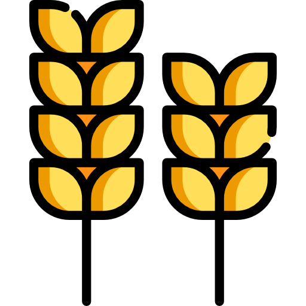

# Farm Chain

A **Farmer-Retailer-Consumer app** developed in **Flutter** powered by a **Blockchain** network in the backend for **Agriculture Supply Chain Management** and providing a completely decentralized, immutable crop tracing and review & feedback system.

## Farm Chain Backend

You can find the backend code [Here](https://github.com/rishavanand/farmchain).
